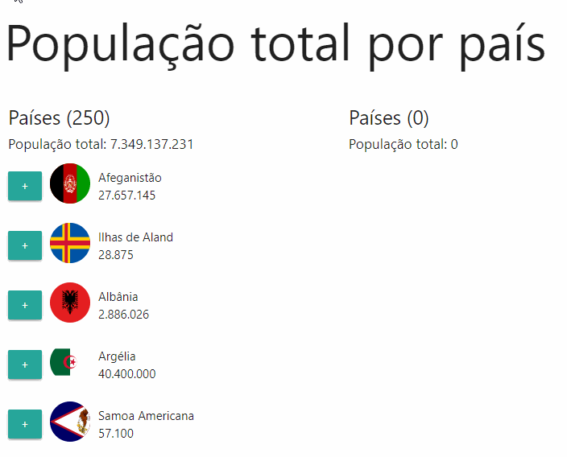

<h2>Lista de países com soma da população</h2>

- Organização do código em funções
- Código auto-documentado
- Utilização de fetch com async/await
- Utilização de template literals
- Sort, Reduce, forEach, find, filter
- Lista em ordem alfabética

  
